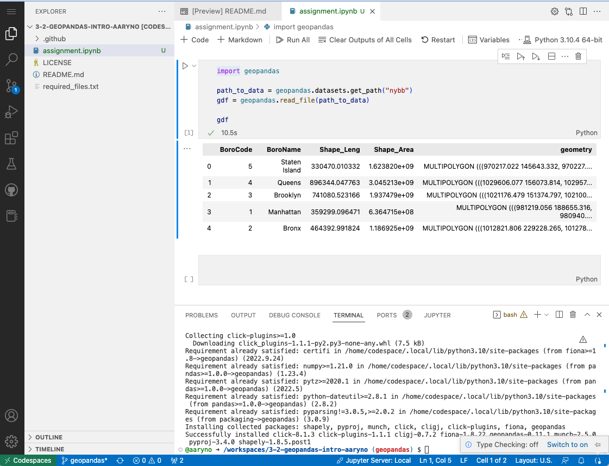

# Python Spatial Programming with Geopandas
## Assignment

### Background
We previously worked with python within the framework of QGIS but python is most flexible when used in stand-alone mode, which allows us to decouple the QGIS framework libraries from the base libraries of python and explicitly add libraries of our own. As with other languages, the power of Python comes from the plethora of high-quality libraries that extend the base functionality of the core python programming language. In the realm of spatial python there are many libraries but we will start with a couple: `geopandas`, `shapely`, `rasterio`, and `rasterstats`. 

#### GeoPandas
Read this [tutorial](https://geopandas.org/getting_started/introduction.html)
Browse/read the GeoPandas [user guide](https://geopandas.org/docs/user_guide.html). This will be a reference for you in this and later assignments. 

- Tutorial: https://geopandas.org/getting_started/introduction.html
- User Guide: https://geopandas.org/docs/user_guide.html

#### Geospatial libraries and notes on documentation 
Geospatial Library Reference:
- [Shapely docs](https://shapely.readthedocs.io/en/stable/manual.html)
- [Geopanda docs](http://geopandas.org/)

Docs can be good or bad. The docs for above range from "ok" to "good" (geopandas).
GeoPandas actually uses the `shapely` model for geometries and while it needs to be installed, there is little direct
interaction with this library on our part except for accessing the `shapely` geometries.


### Directions

#### Setup your codespace
- Create a new branch named `geopandas`.
- From your github assignment repo, click on Code -> Codespaces -> `Create sodespace on geopandas`

#### Install libraries
`geopandas` is not a standard Python library, meaning it is not automatically installed with Python so you will need to install it. 

From your codespace `Terminal` tab, type:
```
pip install geopandas
```
Unless there is an error installing the library you will get a `Successfully installed...` messages in the terminal output: 


#### Create a new Jupyter Notebook
Create a new file in your `Explorer` panel named `assignment.ipynb`. When you open it you will get a dialog to install Extensions for Jupyter and Python. Remember that each codespace is a brand new environment built from basic docker images so when we start a new one we will have to reinstall the extensions. 

Install the Jupyter and Python extensions from the dialog box.

#### Get started with the Geopandas Intro Exercise from geopandas.org. 
Look at https://geopandas.org/en/stable/getting_started/introduction.html. In the first section it shows a couple of Jupyter Notebook cells. A couple of markdown cells describing Reading and Writing files, then a Code cell that starts with `import geopandas`. Go ahead and copy the text from the first cell:
```
import geopandas

path_to_data = geopandas.datasets.get_path("nybb")
gdf = geopandas.read_file(path_to_data)

gdf
```
and paste it into your first cell in your codespace's `assignment.ipynb`:



If it all works well you should see a table listing the 5 boros like the image above.

#### Follow the rest of the GeoPandas Intro Exercise
Follow the rest of the geopandas intro exercise, taking screenshots 
of your codespace at the following parts of the intro:

- `screencap-workspace-gdf.png` -> workspace showing `gdf` after reading `nybb` from file
- `screencap-gdf-dist.png` -> workspace showing contents of a `GeoDataFrame` showing distances from the first one
- `screencap-gdf-centroids.png` -> plot showing just the centroid locations
- `screencap-gdf-buffered-centroid.png` -> plot showing buffered centroids

### Deliverables
Include the 4 screenshots as files in a new branch named `geopandas` and create a new Pull Request to join `geopandas` with `master` _but do not merge it yourself_.

Also include the `assignment.ipynb` file.
